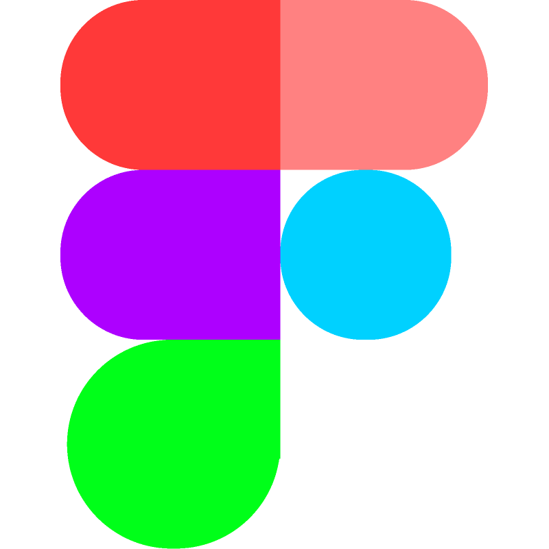

### Hello World 👋 It's [Daniel!](https://nikkardaniel-portfolio.netlify.app/)

 

 

 

Hi, I'm Daniel Nikkar 🙌, a Web Developer and a student at Aalto University. Currently I'm developing new landing page, with a focus on front end, especially animations, while learning the back end. Apart from programming I enjoy ice hockey 🏒, hitting the gym 🏋️ and playing chess ♟️!

## About me

- 💻 Working on a front end redesign.
- 🔭 Studying Information Networks at Aalto.
- 🌱 Learning Node.js, GSAP and SQL.
- 📫 How to reach me: connect with me on Linkedin
- ⚡ Fun fact: I can juggle with 4 balls
- 📝 [Portfolio](https://nikkardaniel-portfolio.netlify.app/) 

## 💬 Languages and 🛠️ Tools

<code></code>
<code></code>
<code></code>
<code></code>
<code></code>
<code></code>
<code></code>
<code></code>
<code></code>
<code></code>

## 📊 GitHub Stats:
 
 

### ✍️ Random Dev Quote

### 😂 Random Dev Meme

---

<!-- Proudly created with GPRM ( https://gprm.itsvg.in ) -->

